# Índice visual — Referências para o NutriSystem

> Use este arquivo abrindo no GitHub ou VS Code com preview de imagens.

## 1. Dietbox — App para Nutricionistas (App Store)

**Tom:** ousado, decorativo, cores fluo, splatters/estrelas, iPhone inclinado, tipografia mista (serif itálica + sans).

| | | |
|---|---|---|
| 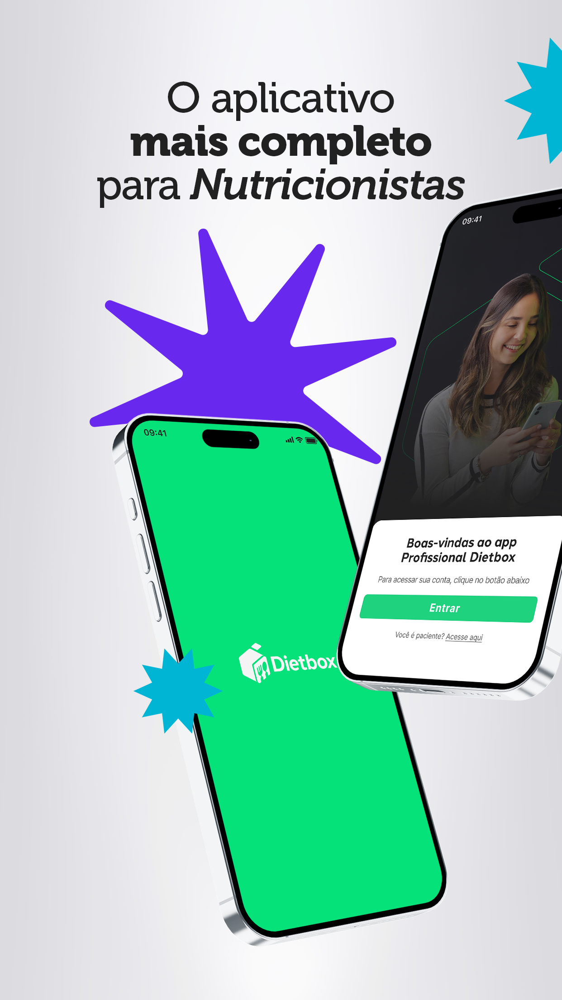 | 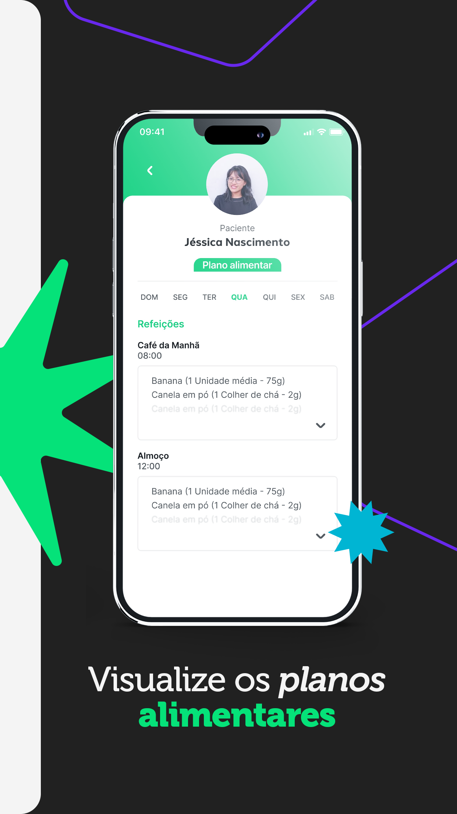 | 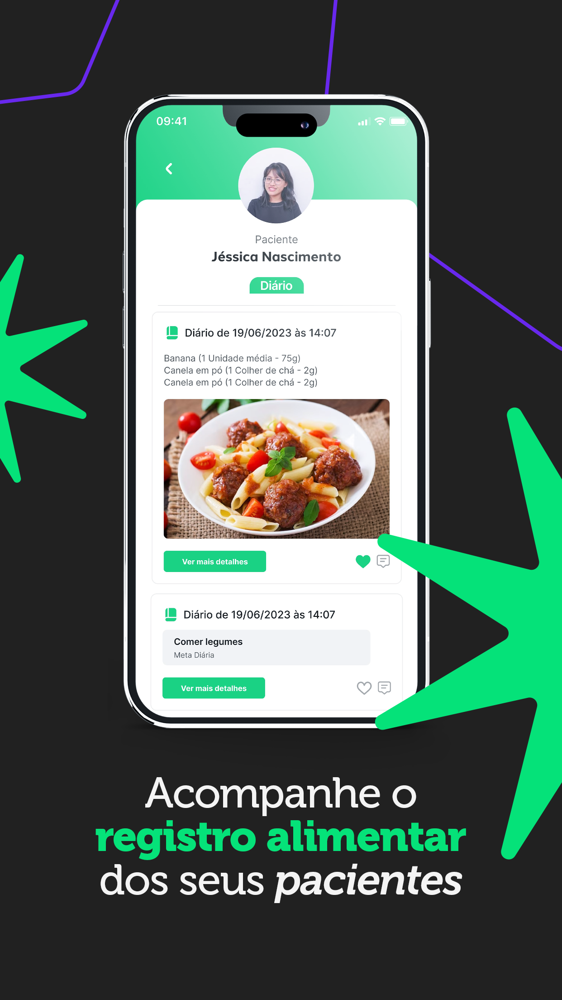 |
| Capa hero — 2 phones + splatters violeta/ciano | Plano alimentar dentro do app | Diário do paciente (refeição com foto) |

## 2. Dietbox — App do Paciente (App Store)

| | | |
|---|---|---|
| 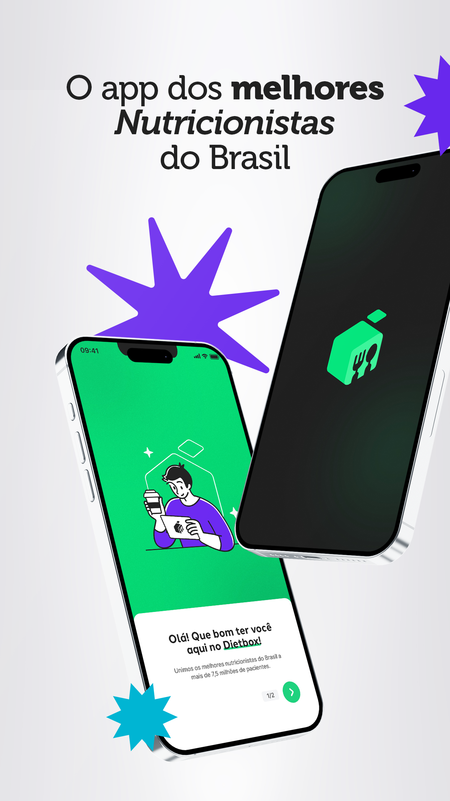 | 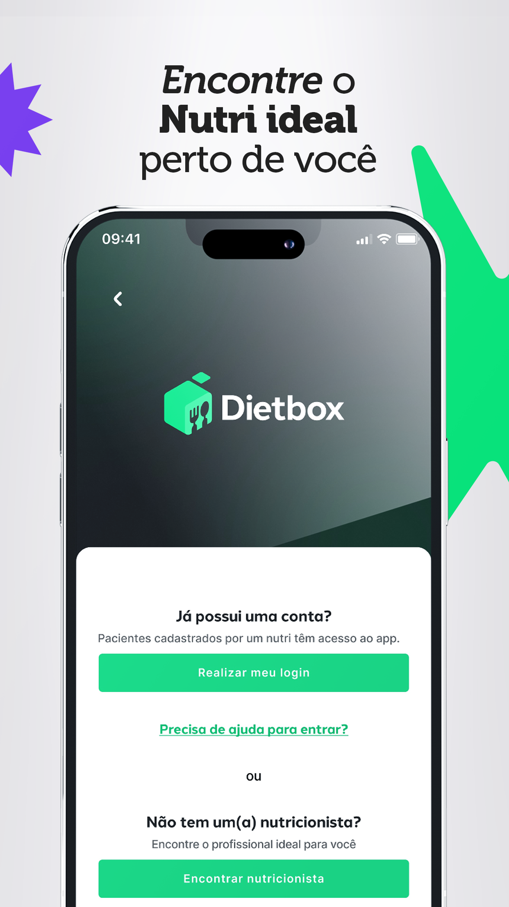 | 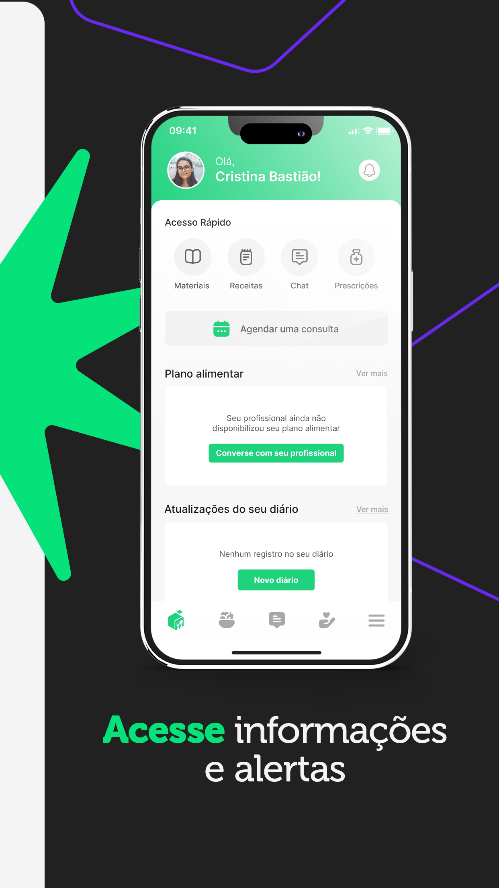 |

## 3. WebDiet — App do Paciente (App Store)

**Tom:** sóbrio, clínico, sem decoração, palavra-chave em verde itálico, iPhone único centralizado.

| | | |
|---|---|---|
| 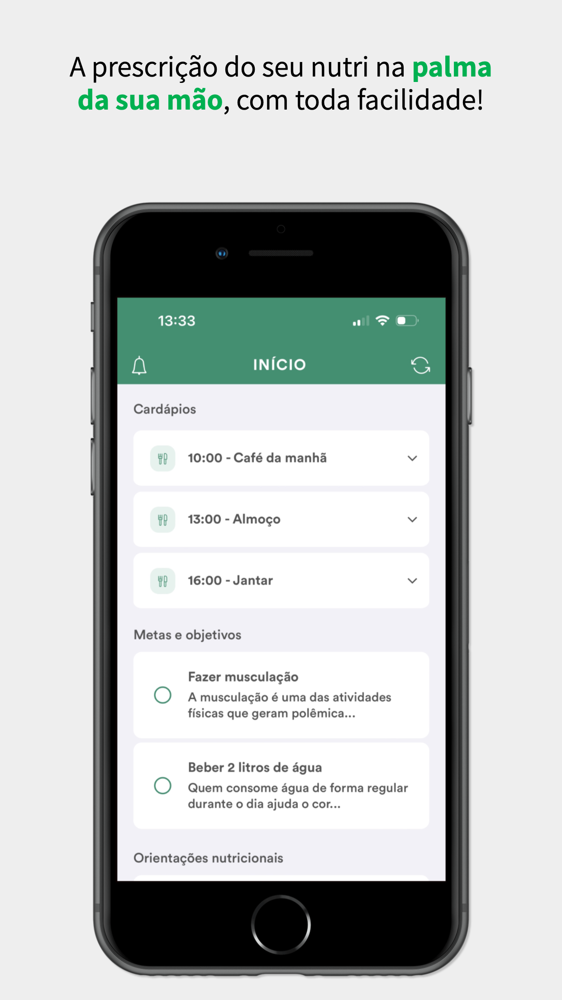 | 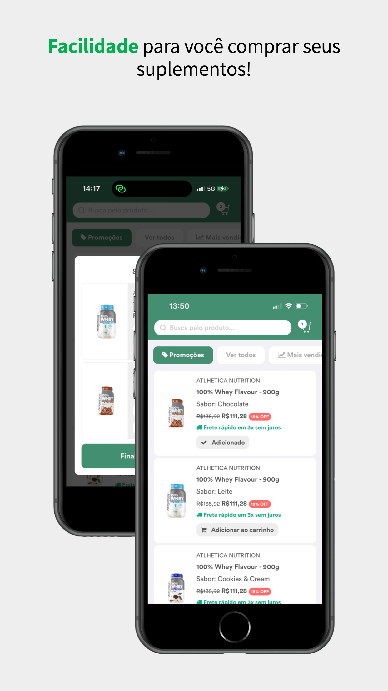 | 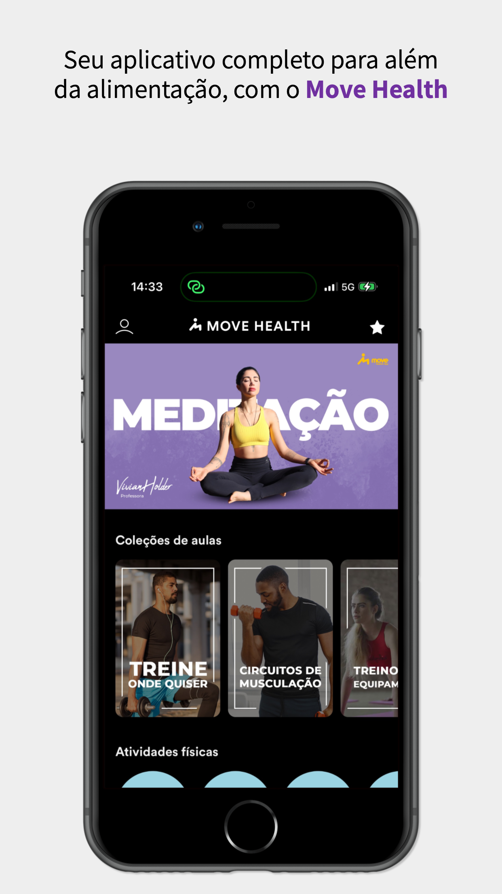 |

## 4. Dietitian — Site oficial

**Tom:** SaaS moderno, glassmorphism, roxo `#7C3AED`, mockup iPhone elegante.

| | |
|---|---|
|  | 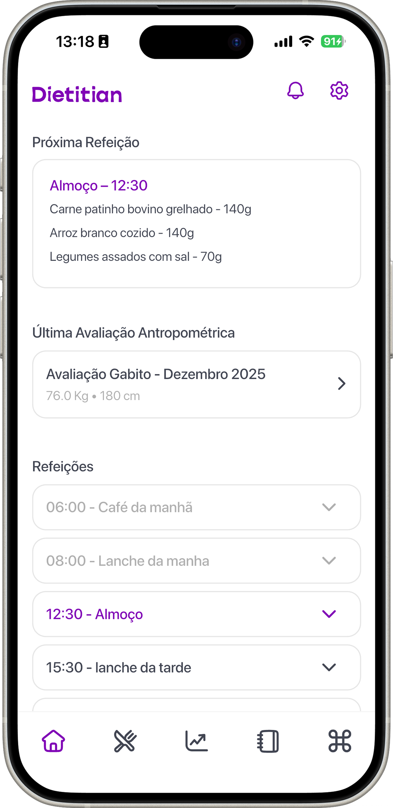 |
| Hero mockup | Tela home do paciente |

## 5. DietSystem — Site oficial

**Tom:** Notion-like, tabelas limpas, badges suaves, paleta similar à nossa.

| | |
|---|---|
| 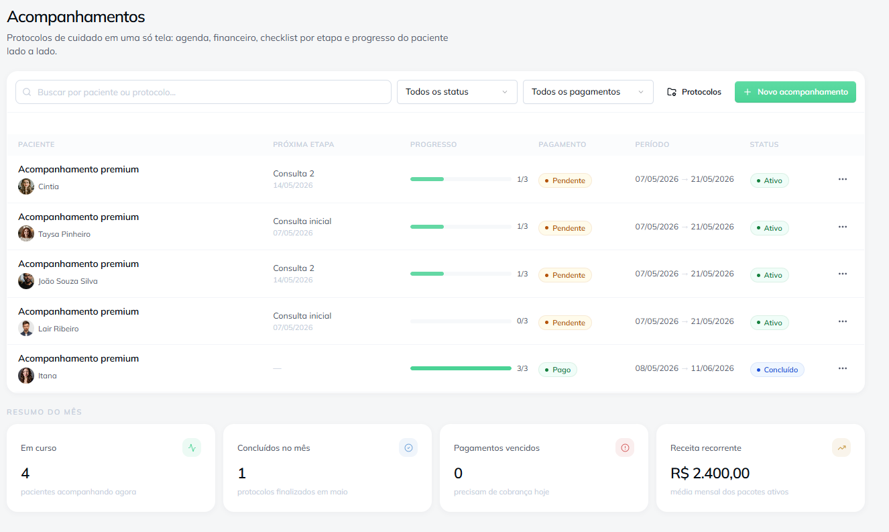 | 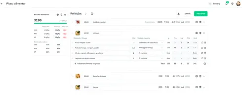 |
| Tabela de acompanhamentos | Hero dashboard |

---

## Decisões aplicadas ao NutriSystem

| Concorrente | O que pegamos | Onde |
|---|---|---|
| **DietSystem** (tabela limpa) | Tabela de pacientes com avatares gradiente + barras de progresso + pills de status | `02-tres-dores/slide-01` |
| **Dietitian** (iPhone elegante) | Mockup iPhone com lista de refeições + agenda do nutri | `04-prontuario/slide-01` |
| **Dietbox** (splatters + iPhone inclinado) | Estrelas verde/violeta/ciano + iPhone com -4° + headline com palavra em itálico verde | `05-plano-alimentar/slide-01` |
| Própria | Glassmorph leve, KPIs em pills verde-claro, fonte Geist Black, cantos 24-32px | Demais slides |

## O que NÃO copiamos (intencionalmente)

- ❌ Verde-flúor saturado do Dietbox — usamos `#10B981` (menta clínico, mesma do design system do produto)
- ❌ iPhone com home button antigo do WebDiet — usamos iPhone 14+ com notch
- ❌ Roxo dominante do Dietitian — roxo só como acento secundário
- ❌ Foto stock de comida — zero imagens fotográficas no kit (só ilustração + UI)
